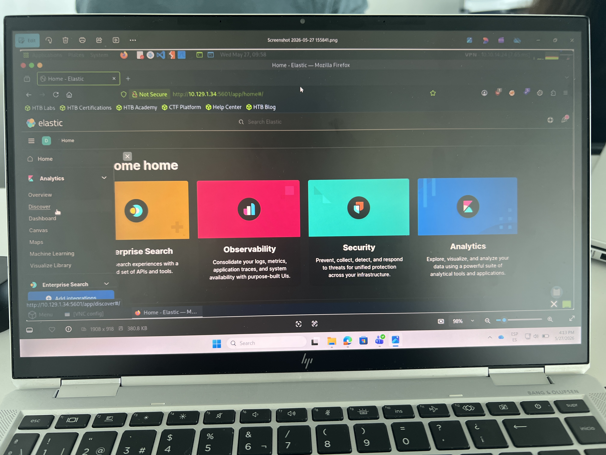
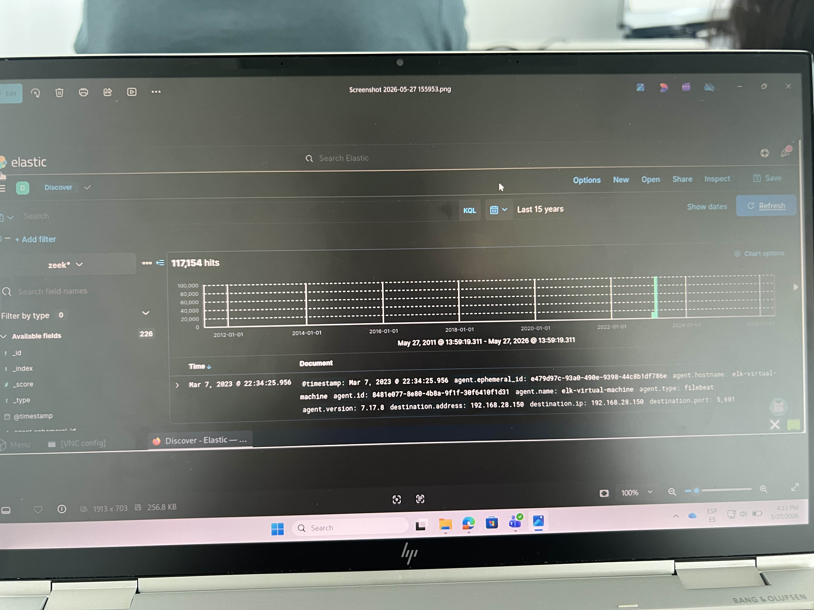
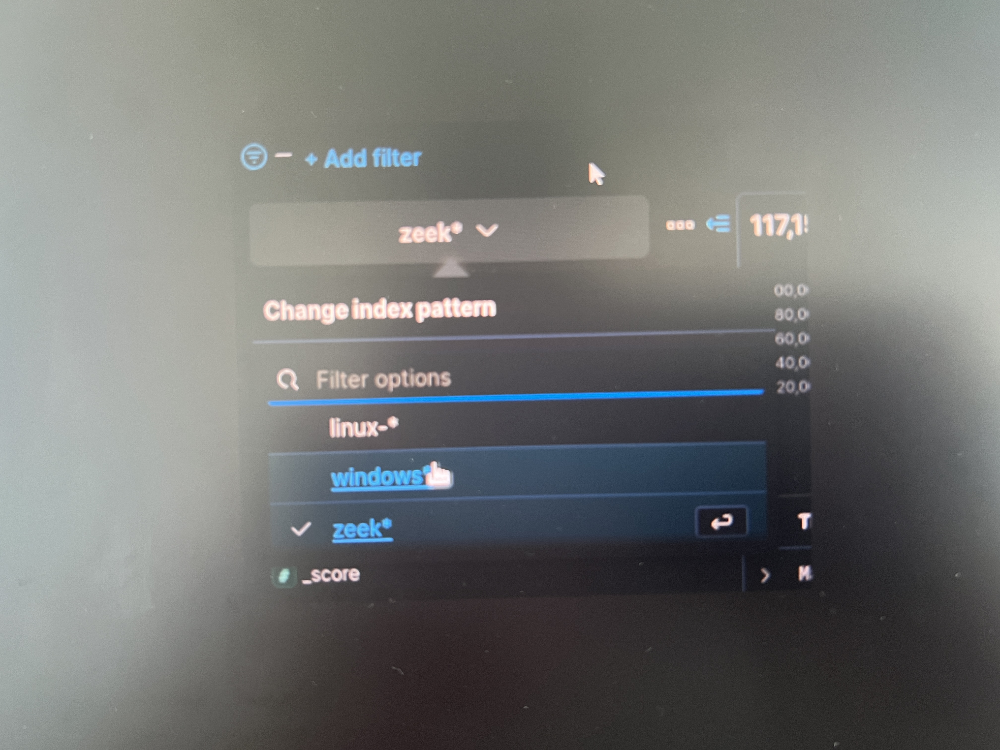
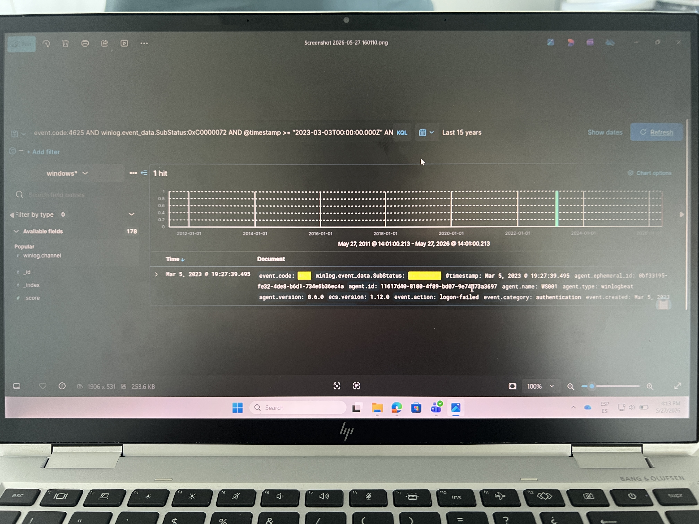
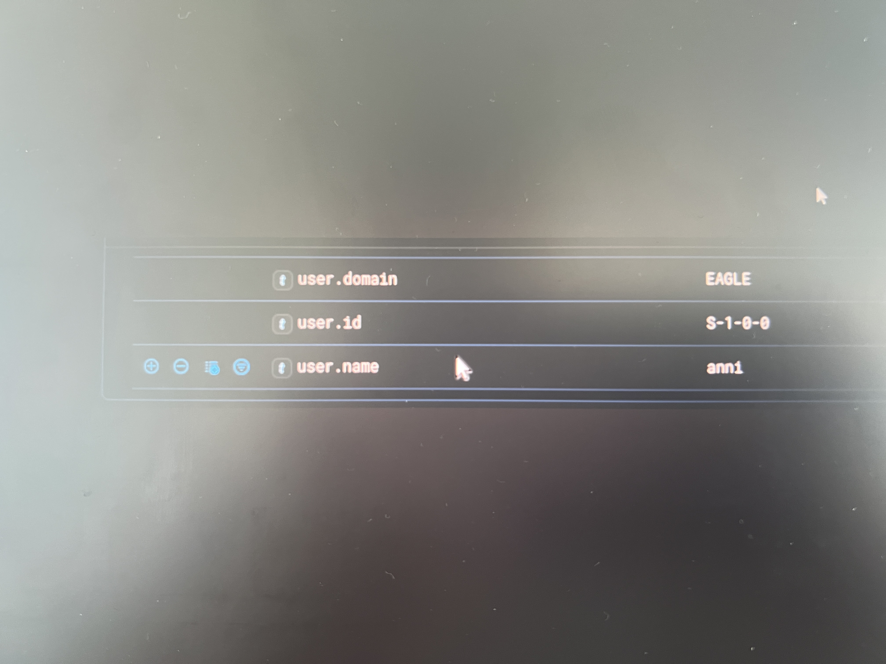
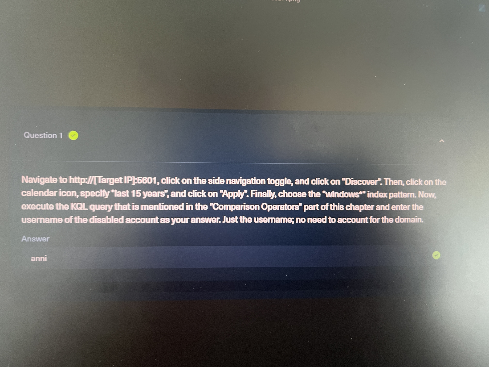
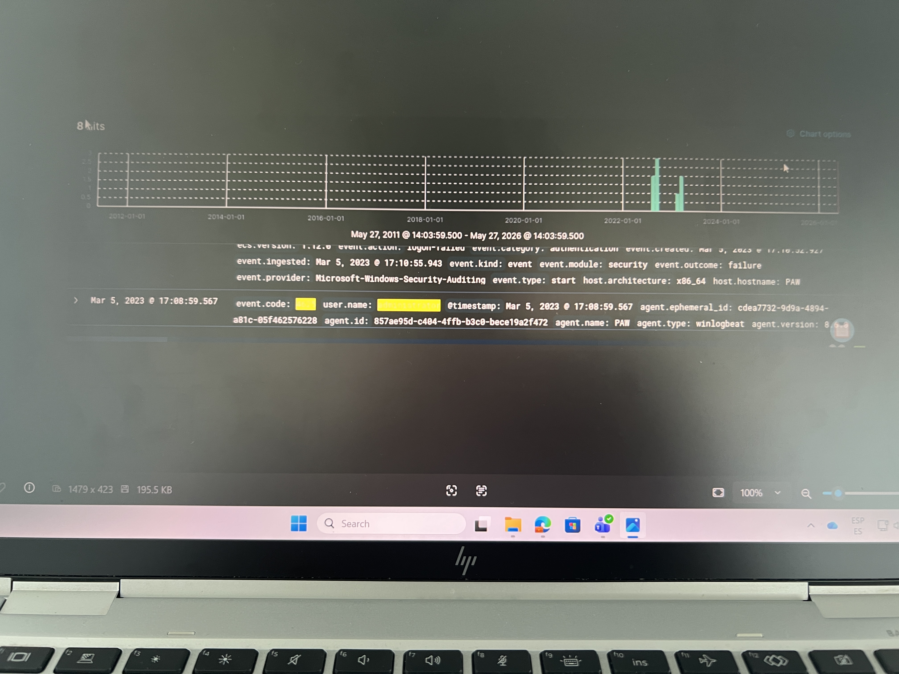
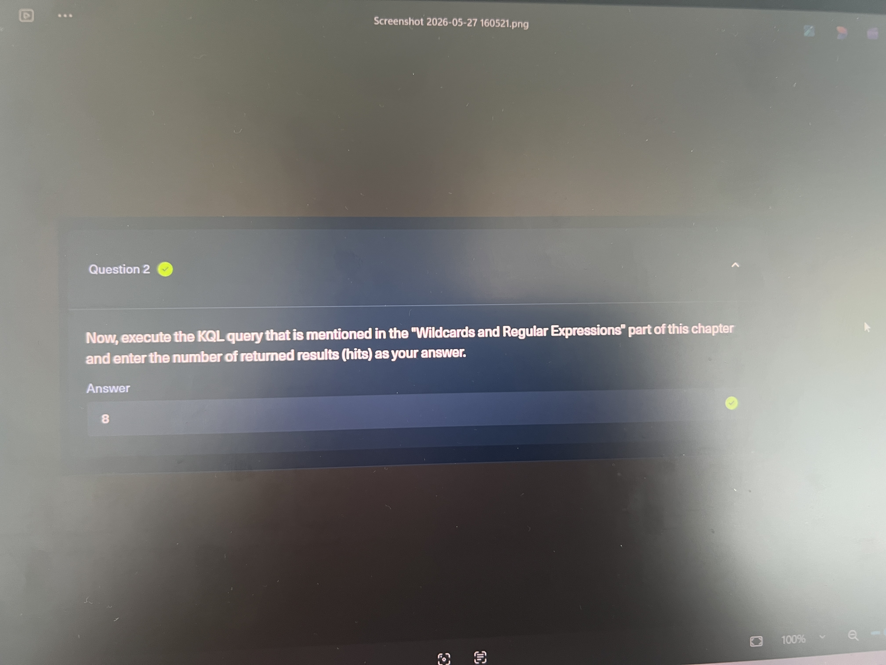

# Introduction to the Elastic Stack

This repository documents a hands-on SIEM practice lab focused on the Elastic Stack and basic Kibana Query Language (KQL) investigations.

## Project Overview

The lab introduced the core Elastic Stack workflow:

- **Beats** collect logs from endpoints.
- **Logstash** can transform and enrich events before forwarding them.
- **Elasticsearch** stores and indexes the data.
- **Kibana** provides the analyst interface for searching, filtering, and visualizing events.

The practical work focused on using Kibana Discover to investigate Windows Security logs and answer questions using KQL.

## Skills Practiced

- Navigating Kibana and the Discover interface
- Selecting index patterns/data views
- Setting a long time range for historical log analysis
- Searching Windows Event ID `4625` failed logon events
- Using ECS fields such as `event.code`, `user.name`, and `@timestamp`
- Using Winlogbeat fields such as `winlog.event_data.SubStatus`
- Applying wildcard searches in KQL

## Investigation Summary

### Disabled Account Failed Logon

The investigation used a KQL query to identify failed Windows logons where the account was disabled.

```kql
event.code:4625 AND winlog.event_data.SubStatus:0xc0000072 AND @timestamp >= "2023-03-03T00:00:00.000Z" AND @timestamp <= "2023-03-06T23:59:59.999Z"
```

The returned event showed a disabled account failed logon and the related username field in the expanded document.

### Admin Username Wildcard Search

The second query searched for failed logon attempts where the username started with `admin`.

```kql
event.code:4625 AND user.name: admin*
```

This returned the matching failed logon events in Kibana Discover.

## Screenshots

| # | Screenshot | Description |
|---|------------|-------------|
| 1 |  | Kibana home page with the side navigation opened and Discover selected. |
| 2 |  | Kibana Discover showing the time picker set to **Last 15 years**. |
| 3 |  | Changing the data view/index pattern from `zeek*` to `windows*`. |
| 4 |  | KQL query for disabled-account failed logons returning one matching event. |
| 5 |  | Expanded event details showing `user.name` as `anni`. |
| 6 |  | Submitted answer confirmation for the disabled account username question. |
| 7 |  | KQL wildcard query for admin-related failed logons returning eight hits. |
| 8 |  | Submitted answer confirmation for the admin wildcard hits question. |

## Key Takeaways

KQL makes it possible to quickly narrow down high-volume Windows security logs. Using ECS fields where possible keeps queries consistent, while source-specific fields such as `winlog.event_data.SubStatus` provide the extra detail needed for Windows event investigations.
